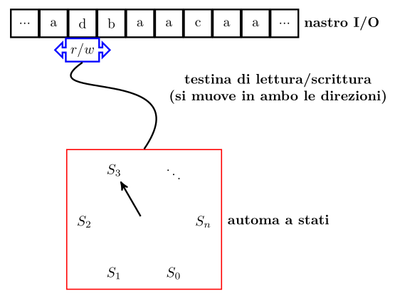
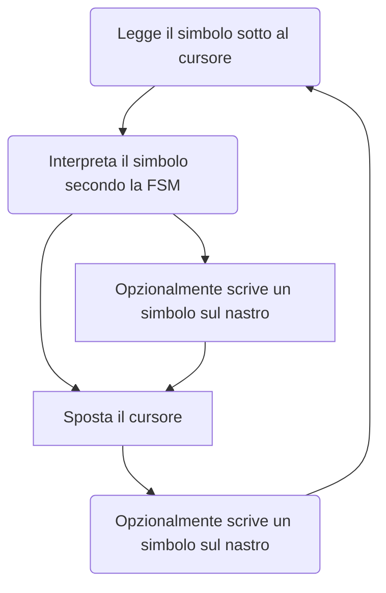

# Concetti generali

A seguire brevi concetti generali di informatica.

## Macchina di Turing

In informatica, una **macchina di Turing** (o più brevemente **MdT**) è un modello matematico teorico che definisce una macchina in grado di eseguire qualsiasi algoritmo _decidibile_.
Una MdT è composta da una _macchina a stati_ (FSM) dotata di una testina/cursore che legge e scrive simboli su un nastro potenzialmente infinito.

Le "decisioni" vengono prese in funzione dei simboli sui nastri, infatti una MdT esegue in continuazione il seguente _loop_:

Le MdT rappresentano una base solida dell'informatica teorica però sono anche utili come metafora semplice per comprendere il funzionamento di un computer odierno.

Se volessimo tracciare un parallelo tra MdT e computer potremmo dire che la macchina a stati è la CPU, il nastro rappresenta la memoria e l'alfabeto dei simboli sul nastro è rappresentato da numeri binari.

Attraverso questo parallelo si può parlare di "architetture":

- di Von Neumann (la più diffusa, PC moderni), il nastro è _unico_ e contiene sia i dati di lavoro che i programmi;
- di Harvard (ad esempio una board Arduino) in cui i nastri del programma e dei dati sono separati.

## Sistemi "monoprogrammati" e "multiprogrammati"

> Un sistema **monoprogrammato** è quello su cui è possibile eseguire un solo programma per volta, dove le istruzioni vengono eseguite una ad una, senza nessun tipo di parallelismo.

> Un sistema **multiprogrammato** è dotato di più CPU o _core_ (MdT) che funzionano in parallelo, su cui è possibile eseguire diversi programmi o suddividere l'esecuzione di un programma.

Tornando alla metafora delle MdT, un sistema multiprogrammato può essere visto come diverse MdT che lavorano su un singolo nastro (o più nastri) governate da un'ulteriore MdT.

Dato che è possibile rimappare diverse MdT con una sola equivalente e che i _microcontrollori_ sono sistemi _monoprogrammati_ (tipicamente, l'ESP32 ha due core), è possibile fare **multiprogrammazione cooperativa**.

Per fare una vera e propria multiprogrammazione servirebbero, oltre a più di una CPU, un sistema operativo con _time sharing_.

## Conversione AD e DA

Le conversioni **AD** (Analogico-Digitale) e **DA** (Digitale-Analogico) sono processi di trasformazione dei segnali che permettono il trattamento dei segnali _analogici_ (mondo reale, fisico) da parte di sistemi digitali (computer).

La conversione **AD**, o "discretizzazione", trasforma un segnale che varia nel tempo con continuità in una serie discreta di misurazioni che rappresentano il segnale originario.
Il procedimento attraverso il quale si ottiene un segnale discreto è il _campionamento_, ovvero la misurazione a intervalli regolari.

Una conversione _AD_ più semplice è quella _booleana_, che verifica la presenza o assenza di segnale (`true` o `false`, `1` o `0`): se durante la lettura leggo \\(1v\\), non è detto che questo rappresenti la presenza di segnale, dato che potrebbe essere un residuo.
Tipicamente vengono prestabiliti dei range di valori che indicano lo stato alto o basso (alto \\(> 2.8v\\), basso \\(< 0.8v\\)).

La conversione **DA** è il processo inverso, si tratta di generare un segnale continuo a partire da una sequenza di valori (misure).

Nelle board i GPIO offrono le funzionalità di _AD_/_DA_.
