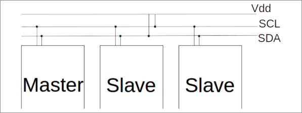
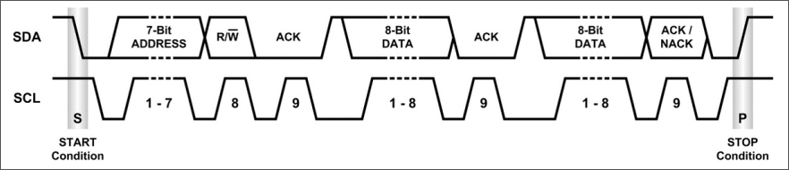

# I2C

**I2C** (si legge I-square-C), acronimo di _Inter-Integrated Circuit_, è un bus seriale ideato per la comunicazione a breve distanza, e in generale all'interno dello stesso computer o sistema embedded.

Tipicamente opera a \\(3.3\text{V}\\) o \\(5\text{V}\\) e a diverse velocità di trasferimento di cui sono "usuali":

- _low-speed mode_ \\(10\ \text{kbit/s}\\);
- _standard mode_ \\(100\ \text{kbit/s}\\);
- _Fast mode_ \\(400\ \text{kbit/s}\\);
- _Fast mode plus (Fm+)_ \\(1\ \text{Mbit/s}\\);
- _High Speed Mode_ \\(3.4\ \text{Mbit/s}\\);

## Come è strutturato

I2C utilizza due linee bidirezionali (open-drain) note come **SDA** (_Serial Data Line_) e **SCL** (_Serial Clock Line_) per interconnettere tra di loro i nodi.
I nodi possono avere due distinti ruoli:

- **Master**: Genera il clock e fa partire la comunicazione con lo slave (possono esserci diversi master);
- **Slave**: Riceve il clock e risponde quando indirizzato dal master.

## Funzionamento

Il segnale del clock (SCL) viene abilitato ogni volta che si intende mandare un singolo bit (tipicamente è nella modalità _"attivo-basso"_[^1]).

- Condizione di start: SCL attivo, SDA disattivato;
- Viene specificato un indirizzo di destinazione da 7 bit più un singolo bit atto ad indicare il tipo di operazione (_read_, _write_);
- Lo slave segue con un segnale di ACK[^2];
- Trasmissione del dato impacchettato in una o più trame da 8 bit l'una, seguite da un altro segnale di ACK/NACK[^2];
- La fine della trasmissione viene marcata da una stop condition, ovvero l'inverso della start: SCL attivo, SDA attivo.

[^1]: Viene considerato attivo quando il segnale è basso, mentre è considerato non attivo quando il segnale è alto 
[^2]: ACK, _acknowledgement_, riconoscimento --ho ricevuto il dato--; NACK, _not acknowledgement_, --non ho ricevuto il dato--.
