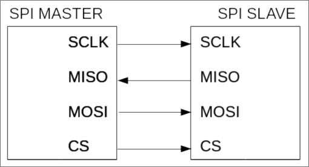

# SPI

**SPI**, acronimo di _Serial Peripheral Interface_, è la specifica di un bus per comunicazione
seriale sincrona utilizzato all'interno dei sistemi embedded per comunicazioni a breve distanza e a velocità bassa.

## Come è strutturato

È una specifica di tipo master/slave _non multimaster_ (a differenza di I2C), basata su 4 segnali:

- **SCLK**: Serial Clock, viene inviato dal master e controlla lo spostamento di bit tra master e slave;
- **MISO**: Master Input Slave Output;
- **MOSI**: Master Output Slave Input;
- **CS**: Chip Select, è utilizzato per selezionare il chip slave che deve essere abilitato alla comunicazione del master.

La comunicazione è più semplice rispetto a I2C; quando il clock viene abilitato dal master vengono trasmessi i bit in modo seriale.
SCLK, MISO e MOSI sono impostati come "_attivo-alto_". Non vi sono né condizioni di inizio e fine trasmissione, né segnali di ACK.
