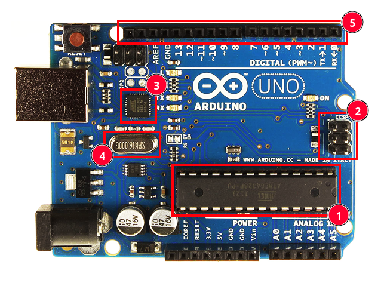

# Introduzione parte pratica

## Termini

- **Sketch**: un programma
- **Blink sketch**: è l'"hello world" dei sistemi embedded, si fa lampeggiare un led

## Ambiente di sviluppo

### Arduino IDE

Inizialmente utilizzato solo con board Arduino, successivamente, data la natura Open Source, diffuso su più board.

È un ambiente di sviluppo (bundle) che unisce le funzionalità di un editor di codice, un compilatore, un linker e un programmatore (meccanismo che permette di trasferire il programma verso un'architettura esterna alla propria).
Quello che in realtà fa l'IDE è lanciare diversi comandi da prompt.

### Le "board"

I dispositivi che utilizziamo sono predisposti per essere scritti e programmati, sono infatti _dispositivi di sviluppo_, _protoboard_.
Quello che verrà incapsulato dentro il prodotto finale è solo il chip, che verrà saldato su un circuito stampato ad hoc.

Una nuova board può presentarsi in uno dei seguenti modi:

- È presente solo il _bootloader_, è quindi necessario compilare e caricare del codice
- È presente sia il _bootloader_ che un piccolo _sketch_ demo, per dimostrare il funzionamento della board
- Assenza di _bootloader_ (caso raro), è possibile scrivere direttamente nella memoria attraverso delle porte logiche

### Comunicazione seriale

La comunicazione tra PC e board è seriale (_rs232_).
I PC moderni comunicano tramite USB, quindi è necessario che ci sia un convertitore che parli da una parte USB e dall'altra seriale.

Il convertitore può essere sia integrato che esterno, nel secondo caso verranno utilizzati i pin `tx` e `rx` per il trasferimento dei dati.

### Bootloader

Il **bootloader** è un programma precaricato in memoria (_DIP_): può essere più o meno complesso e si occupa di far partire o caricare dalla seriale eventuali sketch.

Viene attivato in base ad un'azione hardware che sia all'avvio, alla pressione di un pulsante o di altre azioni simili. Una vola lanciato ci sono diverse casistiche:

- Vi sono dati in ingresso sulla seriale: il bootloader legge l'_header_:
  - l'header indica che vuole scrivere uno sketch \\(\rightarrow\\) effettua l'azione di upload
  - l'header non indica volonà di sovrascittura dello sketch \\(\rightarrow\\) il bootloader procede con la normale esecuzione
- Nessun dato in ingresso dalla seriale:
  - Dopo un certo \\(\Delta{T}\\) esegue una jump alla prima istruzione dello sketch
    - Sketch presente: viene esguito normalmente il programma
    - Sketch non presente: non esegue nulla

In qualsiasi momento è possibile eseguire l'azione di reset, vi sono diversi modi:

- Pressione di un tasto reset
- Cortocircuitare `gnd ` e `gp0`
- Comando da parte del convertitore usb

## Una board vista da vicino

1. **DIP**: _Dual In-line Package_
2. Porta seriale per programmare direttamente sul DIP (`tx` e `rx`)
3. Convertitore USB-Seriale
4. _Oscillatore_
5. _GPIO_
