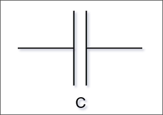

# Condensatore

Il **condensatore** (_capacitor_) è un componente in grado di accumulare temporaneamente elettroni quando viene sottoposto ad una differenza di potenziale.

È composto da due piastre metalliche, dette _armature_, ampie e ravvicinate, separate da un _dielettrico_ (un materiale più isoltante della semplice aria, ne aumenta la capacità).

Il simbolo del condensatore ne ricorda la costruzione:

Quando viene applicata una differenza di potenziale ai suoi capi, gli elettroni si spostano da un'armatura all'altra.
Gli elettroni accumulati su una delle due armature creano una differenza di potenziale che si può utilizzare applicando un carico ai capi del condensatore.

La vera utilità del condensatore è nei circuiti _RC_ (Resistenza-Condensatore) per la "gestione" di segnali variabili nel tempo.

NB: alcuni condensatori non hanno polatità, altri si (elettrolitici).
