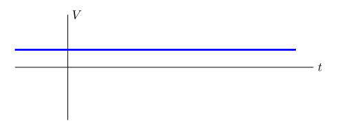
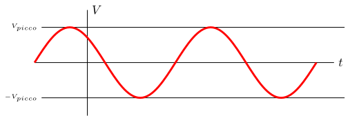
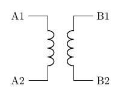
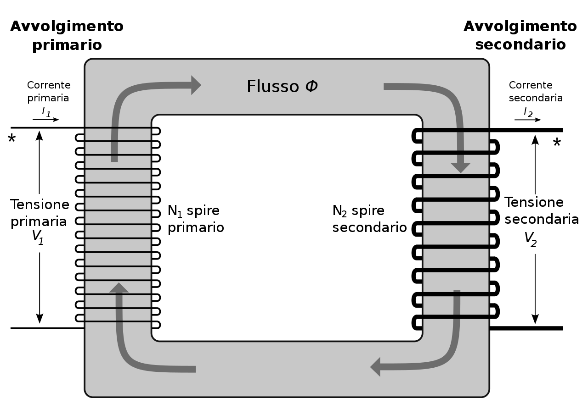

# Corrente continua e alternata

La corrente esiste in due forme: **continua** e **alternata**, la differenza sta nel comportamento degli elettroni che fluiscono nei conduttori.

Nel caso della corrente **continua** gli elettroni si muovono sempre nella stessa direzione.
Graficamente si può notare come, andando avanti nel tempo, la tensione rimane invariata.

    

Nella corrente **alternata** gli elettroni cambiano verso, vanno cioè avanti e indietro secondo una frequenza (\\(50\mathsf{Hz}\\) a \\(220\mathsf{V}\\) della rete italiana).
Graficamente è rappresentata da una sinusoide.

    

La forma alternata è quella più diffusa grazie alla sua **trasformabilità**: la corrente continua non è trasformabile facilmente mentre per quella alternata è sufficiente un **trasformatore**.

## Trasformatore

Il trasformatore è un componente meccanicamente semplice: non ha parti in movimento e non contiene componenti attivi (semiconduttori), deve solo essere eventualmente raffreddato se deve gestire flussi elevati di corrente.
Il suo simbolo:

    

Nella sua forma base è composto da due _bobine_ (avvolgimenti di filo conduttore) vicine (normalmente avvolte sullo stesso nucleo) in modo che il campo elettromagnetico prodotto da una di esse (_avvolgimento primario_) possa influenzare l'altra (_avvolgimento secondario_) inducendo una corrente la cui tensione dipende da quella della prima bobina e dal rapporto fra i numeri di _spire_ delle due bobine.
(Il trasformatore non funziona con una corrente continua, deve essere alternata o pulsante)

    

$$ \frac{V_p}{V_s} = \frac{N_p}{N_s} = k $$

## Segnale variabile nel tempo

È importante tenere presente che un segnale sinusoidale (ma più in generale qualunque segnale variabile nel tempo) trasporta una "potenza" elettica inferiore a quello ipotetico relativo all'ampiezza massima.

Infatti il segnale varia tra un minimo e un massimo potenziale.
La _potenza efficace_ è una "integrazione" della potenza istantanea del tempo, per un segnale perfettamente sinusoidale si calcola con la seguente formula:

$$V_{eff} = \frac{V_{picco}}{\sqrt{2}}$$
