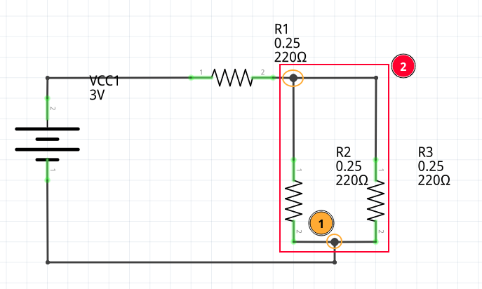

# Leggi di Kirchhoff

Sono una generalizzazione delle _leggi di Ohm_ definendo due leggi di _conservazione_:

- della corrente
- della tensione

> Un "nodo" è un punto di incontro di più percorsi all'interno di un circuito, una giunzione.

> Una _maglia_ è un sotto-circuito che parte da un punto e torna sullo stesso.

1. In arancio, dei nodi
2. In rosso, una _maglia_

## Legge di Kirchhoff delle correnti

La **legge di Kirchhoff delle correnti** formalizza il fatto che in un _nodo_ la somma delle correnti entranti e delle correnti uscenti e pari a zero. In parole povere dice che "non si creano nè spariscono elettroni".

Matematicamente, dati \\(k\\) _segmenti entranti/uscenti da un nodo_:

$$\sum_k I_k = 0$$

## Legge di Kirchhoff delle tensioni

La **legge di Kirchhoff delle correnti** formalizza il fatto che in una _maglia_ la somma elgebrica delle tensioni è zero. In parole povere dice che "non si creano nè spariscono differenze di potenziale".

Matematicamente, dati \\(j\\) _tratti che compongono la maglia_:
$$\sum_j V_j = 0$$
