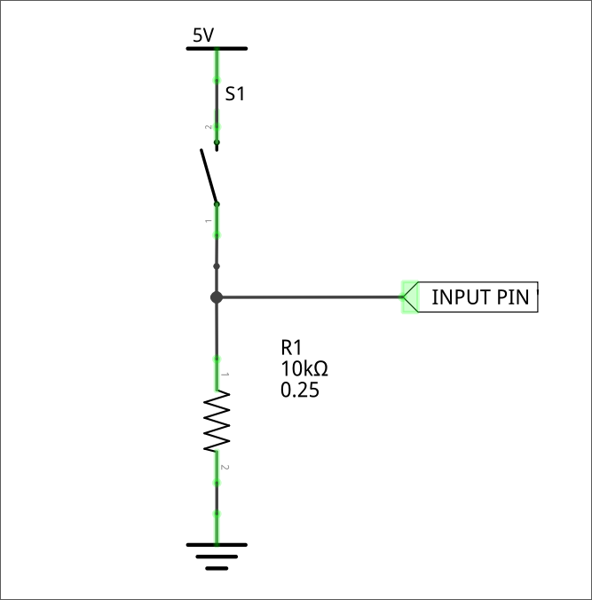

# Resistenza di pull-up/pull-down

Le resistenze di **pull-up** e **pull-down** sono molto comuni quando si utilizzano MCU e dispositivi digitali.

I pin di ingresso dei circuiti digitali presentano un'_impedenza alta_,
questo significa che sono soggetti a captare qualsiasi disturbo elettromagnetico o elettrostatico e quindi a commutare le uscite in modo del tutto imprevisto ed incontrollato.

> Un pin di ingresso collegato a nulla si definisce in stato di **floating** (o dangling)

Viene introdotto quindi il concetto di resistenza di **pull-up** e di **pull-down**:
si inserisce una piccola resistenza tra il pin di ingresso e la tensione di riferimento,
per fare in modo che all'ingresso sia sempre presente un segnale certo.

## Resistenza di pull-up

Se la resistenza viene inserita tra il pin e la \\(V\_{in}\\) si ha una resistenza di **pull-up**.

Quando il pulsante è aperto, il potenziale del pin è impostato alla tensione di \\(V\_{in}\\), dato che trova una resistenza pressoché infinita.
Quando l'interruttore viene chiuso l'ingresso viene portato a massa.

## Resistenza di pull-down

Se la resistenza viene inserita tra il pin e la massa si ha una resistenza di **pull-down**.

Quando il pulsante è aperto, il potenziale del pin è impostato alla tensione della massa, ovvero 0.
Quando l'interruttore viene chiuso l'ingresso viene portato al valore di \\(V\_{in}\\).

NB: la resistenza tra il pulsante e la massa è necessaria in quanto altrimenti si avrebbe un cortocircuito (vedi Kirchhoff)

#### Riassunto

| Tipo      | Chiuso | Aperto |
| --------- | ------ | ------ |
| Pull-up   | `HIGH` | `LOW`  |
| Pull-down | `LOW`  | `HIGH` |
