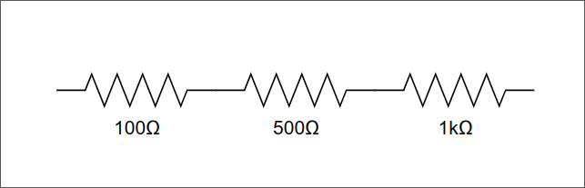
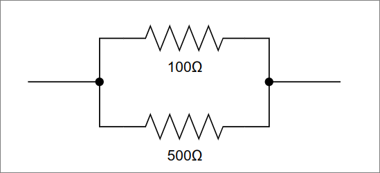

# R in serie e in parallelo

## R in serie

Due (o più) resistenze in serie "sommano" i loro effetti, cioè la resistenza totale è semplicemente la somma delle singole resistenze:

$$ R\_{tot} = R_1 + R_2 + \dotso + R_n $$

#### Esempio

$$ R\_{tot} = R_1 + R_2 + R_3 = 100 \Omega + 500 \Omega + 1k\Omega = 1.6k\Omega $$

## R in parallelo

Nel caso del collegamento in parallelo di resistenze il flusso di corrente si distribuisce proporzionalmente al valore delle resistenze stesse secondo la formula:

$$ \frac{1}{R\_{tot}} = \frac{1}{R_1} + \frac{1}{R_2} + \dotso + \frac{1}{R_n}$$

Nel caso particolare della coppia di resistenze in parallelo si riduce alla formula:

$$ \frac{1}{R\_{tot}} = \frac{1}{R_1} + \frac{1}{R_2} = \frac{R_1 + R_2}{R_1 \ast R_2}$$

che quindi diventa:

$$ R\_{tot} = \frac{R_1 \ast R_2}{R_1 + R_2}$$

#### Esempio

$$ R\_{tot} = \frac{R_1 \ast R_2}{R_1 + R_2} = \frac{100\Omega \ast 500\Omega}{100\Omega + 500\Omega} = 83.33\Omega$$
