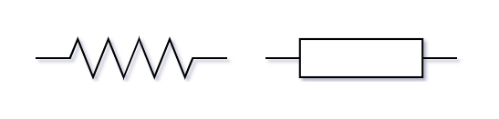
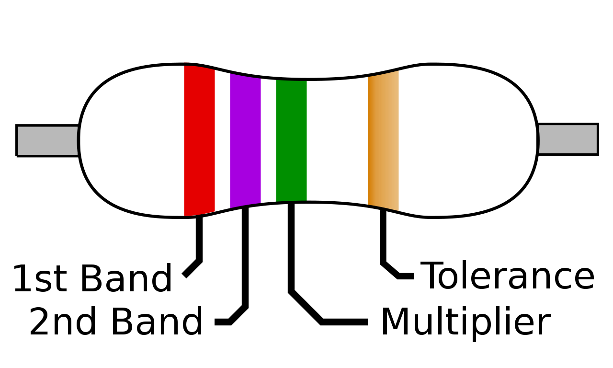
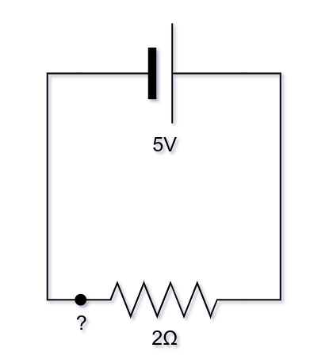

# Resistenze

Una **resistenza** (formalmente **resistore**) è un componenete che resiste al passaggio di corrente.

Se attraversata da un flusso di corrente provoca una caduta di tensione e una perdita di _potenza che viene dissipata in calore_.

Simbolo (entrambi validi):

Nei circuiti elettronici, le resistenze vengono tipicamente utilizzate:

- per la loro caratteristica caduta di tensione, infatti ai capi di una resistenza in cui passa corrente si verifica una caduta di tensione calcolabile mediante la _legge di Ohm_;
- per limitare la corrente massima applicata ad un circuito/componenete data una certa tensione di alimentazione.

## Codifica

Le resistenze, essendo tipicamente di piccole dimensioni, utilizzano un codice colore da cui è possibile capire il valore in \\(\Omega\\) e la percentuale di tolleranza.

#### Tabella per i resistori a strato con 3 o 4 anelli colorati

<table>
  <tbody>
    <tr>
      <th>Colore</th>
      <th>Anello 1</th>
      <th>Anello 2</th>
      <th>Anello 3</th>
      <th>Anello 4</th>
    </tr>
    <tr> 
      <td></td>
      <td>Cifra 1</td>
      <td>Cifra 2</td>
      <td>Moltiplicatore</td>
      <td>Tolleranza</td>
    </tr>
    <tr>
      <td>-</td>
      <td>-</td>
      <td>-</td>
      <td>-</td>
      <td>± 20%</td>
    </tr>
    <tr>
      <td style="color: black; background-color: #d8d8d8">argento</td>
      <td>-</td>
      <td>-</td>
      <td>10−2</td>
      <td>± 10%</td>
    </tr>
    <tr>
      <td style="color: black; background-color: #FFd000">oro</td>
      <td>-</td>
      <td>-</td>
      <td>10−1</td>
      <td>± 5%</td>
    </tr>
    <tr>
      <td bgcolor="#000000">nero</td>
      <td>0</td>
      <td>0</td>
      <td>100</td>
      <td>-</td>
    </tr>
    <tr>
      <td bgcolor="#800000">marrone</td>
      <td>1</td>
      <td>1</td>
      <td>101</td>
      <td>± 1%</td>
    </tr>
    <tr>
      <td style="color: black; background-color: #ff0000">rosso</td>
      <td>2</td>
      <td>2</td>
      <td>102</td>
      <td>± 2%</td>
    </tr>
    <tr>
      <td style="color: black; background-color: #ff8000">arancio</td>
      <td>3</td>
      <td>3</td>
      <td>103</td>
      <td>-</td>
    </tr>
    <tr>
      <td style="color: black; background-color: #ffff00">giallo</td>
      <td>4</td>
      <td>4</td>
      <td>104</td>
      <td>-</td>
    </tr>
    <tr>
      <td style="color: black; background-color: #00d000">verde</td>
      <td>5</td>
      <td>5</td>
      <td>105</td>
      <td>± 0,5%</td>
    </tr>
    <tr>
      <td bgcolor="#0000d0">blu</td>
      <td>6</td>
      <td>6</td>
      <td>106</td>
      <td>± 0,25%</td>
    </tr>
    <tr>
      <td bgcolor="#8000d0">viola</td>
      <td>7</td>
      <td>7</td>
      <td>107</td>
      <td>± 0,1%</td>
    </tr>
    <tr>
      <td bgcolor="#606060">grigio</td>
      <td>8</td>
      <td>8</td>
      <td>-</td>
      <td>-</td>
    </tr>
    <tr>
      <td style="color: black; background-color: white">bianco</td>
      <td>9</td>
      <td>9</td>
      <td>-</td>
      <td>-</td>
    </tr>
  </tbody>
</table>

## Esempio

Esempio di circuito di cui calcolare la corrente

Applicando la legge di Ohm è possibile calcolare la corrente massima che massa in "?":

$$ V = R \ast I \rightarrow 5V = 2 \Omega \ast I \rightarrow I = \frac{5V}{2 \Omega} = 2.5A$$

La potenza dissipata è:

$$P = R \ast I^2 \rightarrow P = 2\Omega \ast 2.5^2A = 2 \ast 6.25 = 12.5W$$
