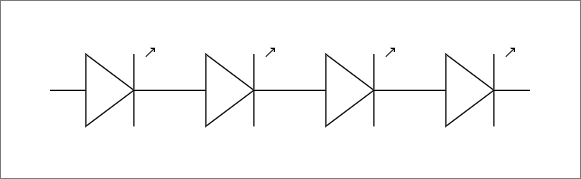
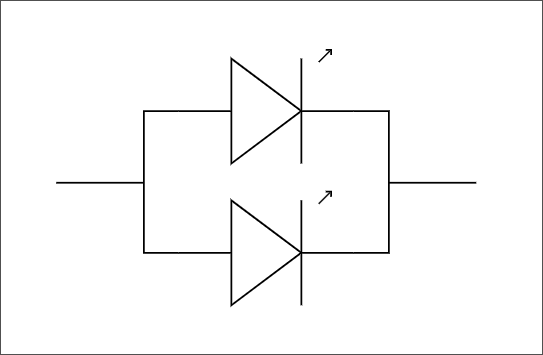

# Serie e parallelo

"In serie" e "in parallelo" sono modi di collegare due o più componenti tra loro.

### Serie

Il collegamento in **serie** è quello in cui i componenti sono "accodati" uno con l'altro:

In questo caso il flusso di corrente passa prima in un componente e poi nell'altro. La stessa _corrente_ attraversa ogni "bipolo" della serie.

### Parallelo

Il collegamento in **parallelo** è quello in cui ogni componente è "affiancato" all'altro:

In questo caso il flusso della corrente si partiziona (non necessariamente al 50%) nei due rami.
La _tensione_ è comune a tutti i "bipodi" in parallelo.
