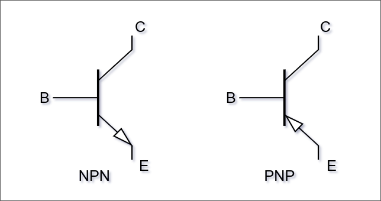

# Transistor

Il **transistor** è un semiconduttore composto da tre terminali detti **B**ase, **C**ollettore ed **E**mettitore.
La _base_ controlla il flusso di corrente tra _collettore_ ed _emettitore_.

Il transistor si comporta come un rubinetto della corrente: la corrente che fluisce tra Emettitore (di elettroni) e Collettore (raccoglie ciò che arriva dell'Emettitore) è _funzione della corrente_ che scorre tra Emettitore e Base.

Si realizza una situazione in cui una _piccola corrente_ (quella che "pilota", tra E e B) _influenza una grande corrente_ (quella tra E e C).

I transistor più diffusi sono quelli bipolari e ne esistono di tipo **NPN** e **PNP**:

## Utilizzo in elettronica digitale

In elettronica _digitale_ i transistor si usano in maniera "booleana" (on/off).

Hanno il vantaggio di non avere parti meccaniche, di lavorare con tensioni e correnti basse e di avere dimensioni piccole (ordine di grandezza \\(10nm\\) dentro i chip integrati).
