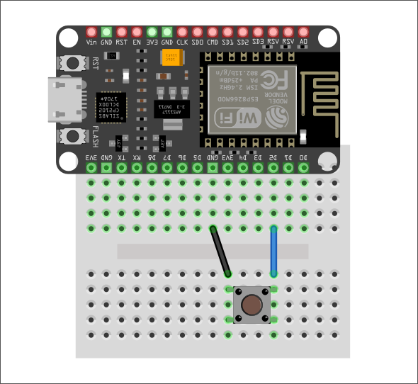

# Interrupt

Il meccanismo visto precedentemente per "catturare" un valore esterno, come la pressione di un bottone, era quello di continuare a leggere continuamente il suo valore: questa tecnica prende il nome di **polling**.
Questa tecnica però potrebbe sfruttare in maniera intensiva il processore, poiché il microcontrollore è in continua fase di checking riguardo il cambiamento di stato della tensione.

L'**interrupt** è un meccanismo alternativo di reazione agli stimoli esterni (e interni).

- Interrupt _hardware_: Si verificano in risposta a un evento esterno;
- Interrupt _software_: Si verificano in risposta a un'istruzione software (timer, watchdog)

Il modo per realizzare un interrupt è quello di associare ad un PIN e ad un evento un comportamento (funzione).

## Associare un Interrupt ad un GPIO

In Arduino IDE, lo si fa attraverso la funzione `attachInterrupt()`:

```C
attachInterrupt(GPIOPin, ISR, Mode);
```

- `GPIOPin` - imposta il pin GPIO come pin di interrupt;
- `ISR` - è il nome della funzione che verrà chiamata ogni volta che si verificherà un interrupt;
- `Mode` - definisce quando l'interrupt deve essere attivato.

| Mode      | Evento                                                      |
| --------- | ----------------------------------------------------------- |
| `LOW`     | Attiva l'interrupt ogni volta che il pin è `LOW`            |
| `HIGH`    | Attiva l'interrupt ogni volta che il pin è `HIGH`           |
| `CHANGE`  | Attiva l'interrupt ogni volta che il pin cambia valore      |
| `FALLING` | Attiva l'interrupt quando il pin passa da `HIGH` a `LOW`    |
| `RISING`  | Attiva l'interrupt quando il pin passa da `BASSO` ad `ALTO` |

Per rimuovere un PIN da un interrupt si utilizza la funzione `detachInterrupt(GPIOPin)`.

### Interrupt Service Routine

L'**ISR** (Interrupt Service Routine) è la funzione che viene invocata ogni volta che si verifica un interrupt sul GPIO.

Nel caso di ESP8266 e ESP32, queste funzioni, vanno marcate con un attributo specifico (`IRAM_ATTR`) per far si che il codice compilato venga
inserito nella RAM interna della board (**IRAM**).[¹](https://docs.espressif.com/projects/esp-idf/en/latest/esp32/api-guides/memory-types.html#iram-instruction-ram)

Esempio:

```C
void IRAM_ATTR ISR() {
    ...
}
```

## Dimostrazione interrupt

<div style="text-align: center"></div>

Il seguente sketch conta quante volte il bottone viene premuto.

```C
struct Button {
  const uint8_t PIN;
  int count;
  bool pressed;
};

Button btn { D2, 0, false };

void IRAM_ATTR btnPressed() {
  btn.count++;
  btn.pressed = true;
}

void setup() {
  Serial.begin(115200);

  pinMode(btn.PIN, INPUT_PULLUP);
  attachInterrupt(btn.PIN, btnPressed, FALLING);
}

void loop() {
  if (btn.pressed) {
    Serial.printf("Pressed %d times\n", btn.count);
    btn.pressed = false;
  }
}
```

NB: non tutti i GPIO supportano gli interrupt.

### Switch bounce

Un problema che salta subito all'occhio è che l'interrupt viene attivato più volte per lo stesso evento.
Osservando il monitor seriale, si noterà che anche se si preme il pulsante una sola volta, il contatore viene incrementato più volte.

Quello che succede è un fenomeno puramente meccanico detto _switch bounce_: le parti iterne del bottone entrano in contatto diverse volte prima di stabilizzarsi in un determinato stato, questo causa diversi interrupt.

Il processo di eliminazione dello _switch bounce_ è detto _debouncing_ e si può fare in due modi:

- Via _hardware_ filtrando il segnale per smussare la transizione (filtro RC);
- Via _software_ ignorando per un breve periodo altri interrupt dopo l'attivazione del primo.

### Dimostrazione interrupt con debouncing

```C
struct Button {
  const uint8_t PIN;
  int count;
  bool pressed;
};

Button btn{ D2, 0, false };

// variabile per tenere traccia del tempo tra una pressione e l'altra
unsigned long current_time = 0; // quando è avvenuta la pressione "attuale"
unsigned long last_time = 0;    // pressione "passata"

void IRAM_ATTR btnPressed() {
  current_time = millis();               // istante di tempo "attuale"
  if (current_time - last_time > 250) { // "elapsed_time" > 250ms
    btn.count++;
    btn.pressed = true;
    last_button_time = button_time;     // salvo l'istante di tempo attuale come "passato"
  }
}

void setup() {
  Serial.begin(115200);

  pinMode(btn.PIN, INPUT_PULLUP);
  attachInterrupt(btn.PIN, btnPressed, FALLING);
}

void loop() {
  if (btn.pressed) {
    Serial.printf("Pressed %d times\n", btn.count);
    btn.pressed = false;
  }
}
```

Ogni volta che `btnPressed` viene eseguita,
confronta l'istante di tempo corrente, restituito da `millis()`, con l'istante di tempo in cui è stata chiamata per l'ultima volta.

NB: `millis()` all'interno di una ISR non incrementa.
