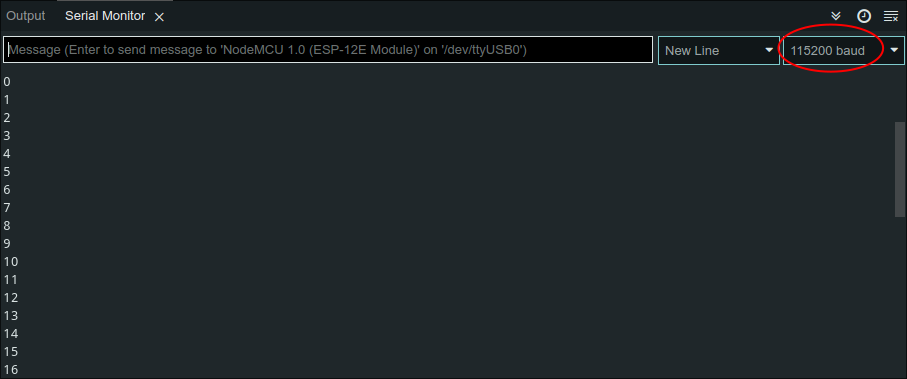

# Scrittura su seriale

Per poter scrivere sulla porta seriale della board dobbiamo tener conto del **baud**, ovvero la velocità di comunicazione su un canale dati.

Il seguente incrementa ogni secondo una variabile e ne stampa il contenuto:

```C
int count = 0;

void setup() {
  Serial.begin(115200);
}

void loop() {
  Serial.println(count++);
  delay(1000);
}
```

L'istruzione `Serial.begin(115200);` inizializza la porta seriale con un boud rate di \\(115200\mathrm{bps}\\); per stampare (ed incrementare) la variabile viene utilizzata `Serial.println(count++)`.

Per poter visualizzare l'output dobbiamo aprire il monitor di Arduino (Tools -> Serial Monitor) ed impostare il corretto boud (\\(115200\mathrm{bps}\\))

<div style="text-align: center"></div>

## Versione con esp-rs

- Board: Nodemcu v3 esp8266

Il setup del progetto è lo stesso della [demo](../lab/esp8266_blink_rs.md), eccetto per il file `.cargo/config.toml`, che dovrà essere configurato correttamente per monitorare la seriale.

La parte da modificare è la seguente:

```toml
[target.xtensa-esp8266-none-elf]
runner = "espflash --monitor --monitor-speed 115200 /dev/ttyUSB0"
```

I flag `--monitor` e `--monitor-speed` ci permettono di monitorare la porta seriale con un baud di \\(115200\mathrm{bps}\\).
Purtroppo il crate `esp8266-hal` non è più in sviluppo e non c'è un modo per impostare un baud a piacimento.

Il codice analogo è il seguente:

```rust
#![no_std]
#![no_main]

use core::fmt::Write;
use esp8266_hal::prelude::*;
use esp8266_hal::target::Peripherals;
use panic_halt as _;

#[entry]
fn main() -> ! {
    let dp = Peripherals::take().unwrap();
    let pins = dp.GPIO.split();
    let mut serial = dp
        .UART0
        .serial(pins.gpio1.into_uart(), pins.gpio3.into_uart());

    let (mut timer1, _) = dp.TIMER.timers();

    let mut count: u16 = 0;
    writeln!(&mut serial, "\nstart:").unwrap();

    loop {
        writeln!(&mut serial, "{}", count).unwrap();
        count += 1;
        timer1.delay_ms(1000);
    }
}
```

Nel metodo per creare l'istanza di una porta seriale vanno specificati manualmente i pin `rx` e `tx`: nella mia esp8266 sono rispettivamente `gpio3` e `gpio1`.

```rust
let mut serial = dp
    .UART0
    .serial(pins.gpio1.into_uart(), pins.gpio3.into_uart());
```

Per scrivere sulla seriale utilizziamo le macro `write!` e `writeln!` passando `serial` come buffer.
