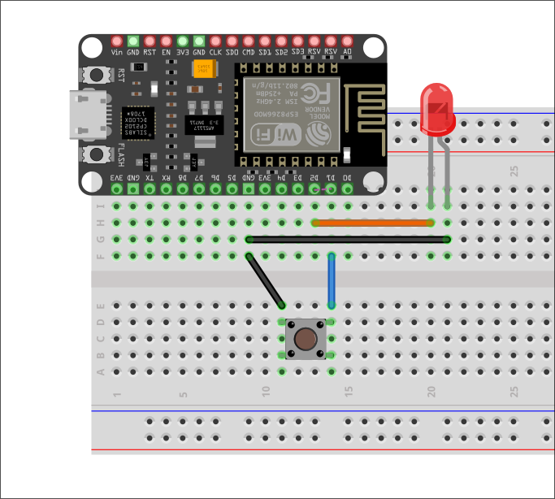

# Input PULLUP (e PULLDOWN)

## PIN Mode

Possiamo utilizzare i pin digitali per leggere dati da un sensore o per scrivere dati su un attuatore:

| PIN Mode | Serve per...                  | Cosa                     |
| -------- | ----------------------------- | ------------------------ |
| INPUT    | Legge dati da un sensore      | `HIGH` (`1`)/`LOW` (`0`) |
| OUTPUT   | Scrivere dati su un attuatore | `HIGH` (`1`)/`LOW` (`0`) |

Esiste inoltre una terza opzione: `INPUT_PULLUP`. Questa opzione è analoga ad `INPUT` (legge dati da un sensore), ma oltre a questo, viene attivata una _resistenza di pull-up **interna**_, per mantenere il segnale `HIGH` di default.

- 👉[Resistenza di pull-up](../../capitolo03/Resistenza_pullup_pulldown.md)

Quando è utile la modalità `INPUT_PULLUP`? Consideriamo il seguente esercizio...

## Accensione led alla pressione di un bottone

<div style="text-align: center"></div>

- Il led è collegato `D2`
- Il bottone è collegato a `D1`; se non si ha un bottone è possibile usare due jumper

L'esercizio è relativamente semplice: alla pressione del bottone il led deve rimanere acceso, una volta rilasciato il bottone, questo deve spegnersi.

Il problema sta nel bottone: quando non viene premuto rimane in uno stato fluttuante (_floating_, _dangling_); qua entra in gioco la modalità `INPUT_PULLUP`.

```c
#define BTN D1
#define LED D2

void setup() {
  // pinMode(BTN, INPUT); SBAGLIATO
  pinMode(BTN, INPUT_PULLUP);
  pinMode(LED, OUTPUT);
  Serial.begin(115200);
}

void loop() {
  int pressed = !digitalRead(BTN); // PULLUP HA LOGICA INVERTITA
  // Serial.println(pressed); DEBUG

  if (pressed)
    digitalWrite(LED, HIGH);
  else
    digitalWrite(LED, LOW);

  delay(50);
}
```

Utilizzando `INPUT_PULLUP` evitiamo comportamenti indesiderati e imprevedibili.
