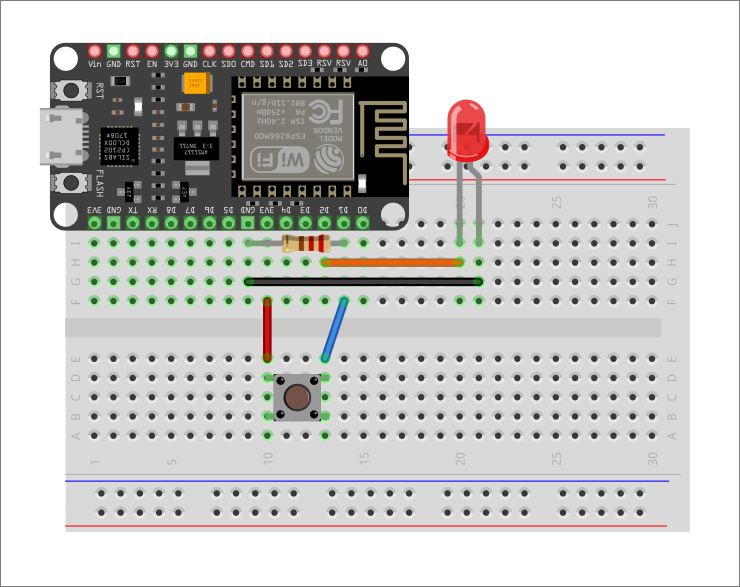

# Versione con pull-up esterno

Una versione alternativa dell'esercizio è utilizzare una resistenza pull-up esterna:

<div style="text-align: center"></div>

La differenza sta nella resistenza da \\(10\mathrm{k\Omega}\\) tra il pin dei \\(3.3\mathrm{V}\\) e `D1`.
Lo sketch è analogo al precedente, eccetto per `INPUT` al posto di `INPUT_PULLDOWN`.

```c
void setup() {
    ...
    pinMode(BTN, INPUT);
    ...
}
```

## Versione con pull-down (esterno)

Una ulteriore versione alternativa dell'esercizio è utilizzare una resistenza pull-down esterna:

<div style="text-align: center"></div>

In questo caso vi sono più differenze:

- la resistenza (da \\(10\mathrm{k\Omega}\\)) è collegata tra `D1` e `GND`;
- il bottone è collegato tra il pin dei \\(3.3\mathrm{V}\\) e `D1`.

Un'altra cosa da tenere in mente è che la resistenza pull-down non ha logica invertita:

```c
void loop() {
  // int pressed = !digitalRead(BTN);  PULLUP: logica invertita
  int pressed = digitalRead(BTN); // PULLDOWN NON HA LOGICA INVERTITA

  if (pressed)
    digitalWrite(LED, HIGH);
  else
    digitalWrite(LED, LOW);

  delay(50);
}
```
