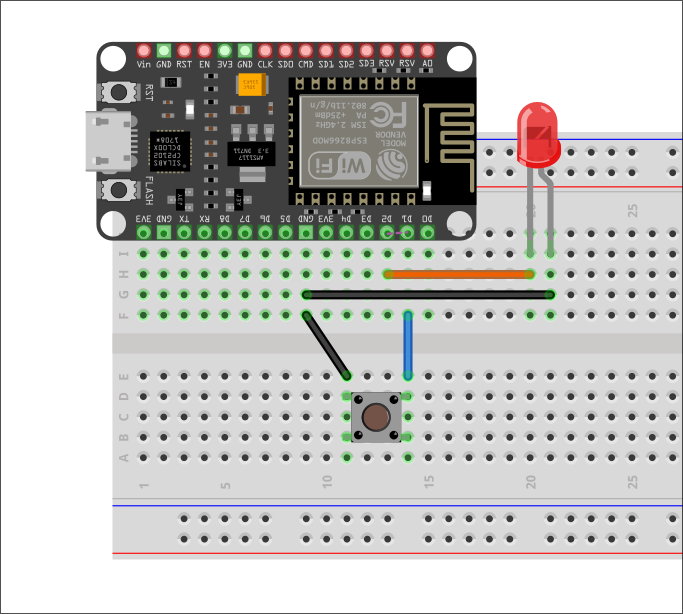

# Versione con esp-rs

- Board: Nodemcu v3 esp8266
- Struttura progetto: stessa della [demo](../esp8266_blink_rs.md)

Circuito di riferimento:

<div style="text-align: center"></div>

Sketch:

```rust
#![no_std]
#![no_main]

use esp8266_hal::prelude::*;
use esp8266_hal::target::Peripherals;
use panic_halt as _;

#[entry]
fn main() -> ! {
    let dp = Peripherals::take().unwrap();
    let pins = dp.GPIO.split();

    let btn = pins.gpio5.into_pull_up_input();        // D1
    let mut led = pins.gpio4.into_push_pull_output(); // D2

    let (mut timer1, _) = dp.TIMER.timers();

    loop {
        let pressed = btn.is_low().unwrap();

        if pressed {
            led.set_high().unwrap();
        } else {
            led.set_low().unwrap();
        }

        timer1.delay_ms(50);
    }
}
```

Per le versioni con le resistenze esterne besta usare

```rust
    ...
    let btn = pins.gpio5.into_floating_input();
    ...
```

e i circuiti analoghi.
